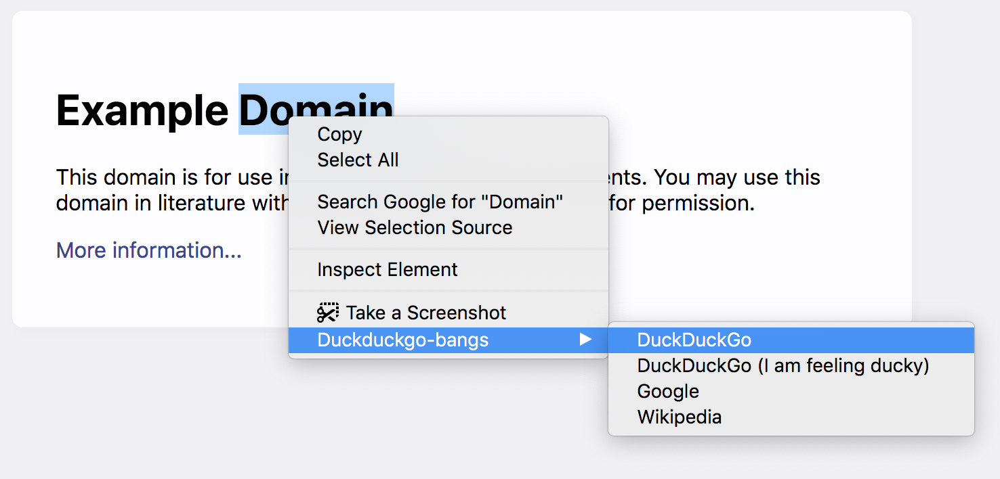
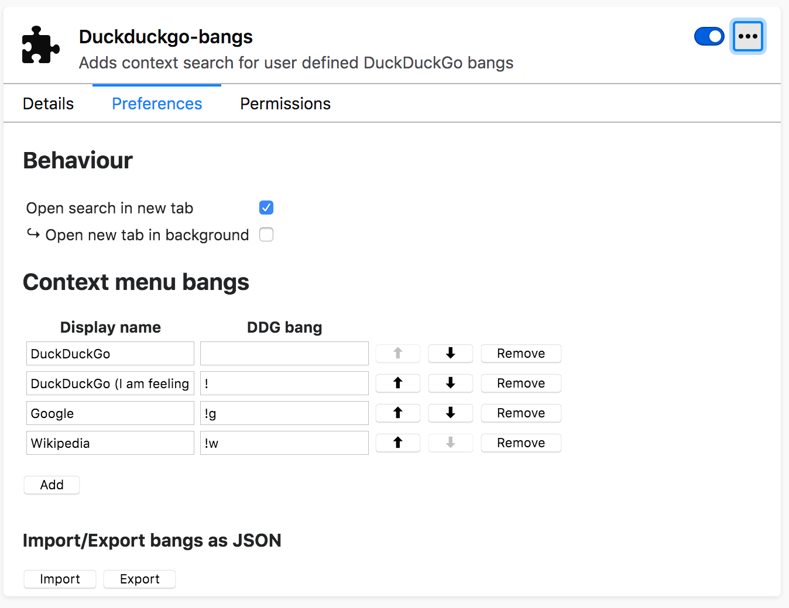

# Duckduckgo-bangs

A Firefox Webextension to give the user a context menu to search selected text.

Bangs and their display name in the menu are fully customizable and there is an option to open search in the same or in a new tab.

This extension is unofficial and has no affiliation with DuckDuckGo.

## Building
`npm run start` will start a watcher and fire up Firefox for testing.
`npm run build` builds the final extension to upload to AMO.

To lint: `npm run lint`.

`$WEB_EXT_FIREFOX` may need to be set if not using Firefox stable. See https://extensionworkshop.com/documentation/develop/web-ext-command-reference/#--firefox
